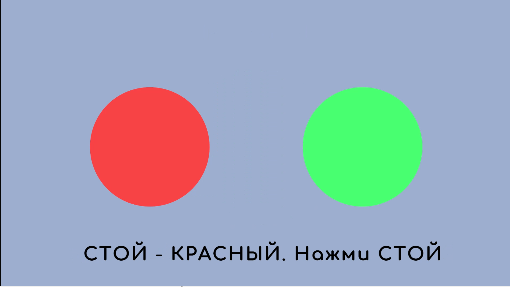
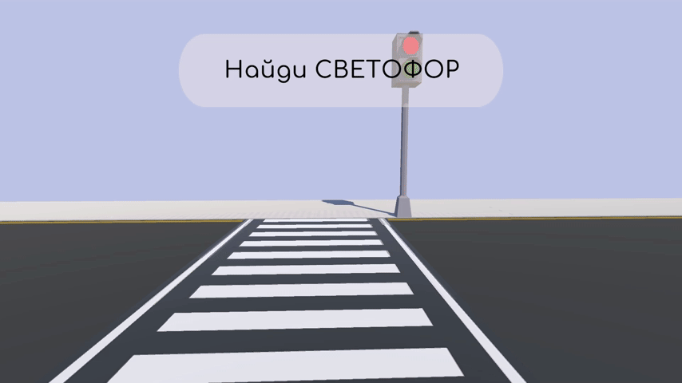

# SocialQuest - игровой 3D-тренажёр для детей с РАС

Игровой тренажер выполнен в рамках дипломного проекта ("Диплом как стартап") и представляет собой Unity-приложение. 
Тренажер предназначен для формирования и поддержки социально-бытовых навыков у детей с расстройствами аутистического спектра (РАС) через моделирование определенной социально-бытовой ситуации.
В данной демонстрационной версии представлен код первого уровеня игровой сцены - "Переход через дорогу". 
### Структура тренажера

Каждый модуль тренажера моделирует одну социально?бытовую ситуацию (в данном случае – переход через дорогу) и состоит из нескольких уровней с прогрессивным усложнением. Перед каждым уровнем имеется подготовительный этап. Каждый уровень делится на последовательные задания, которые ребенок должен выполнить одно за другим. Задание считается завершенным только после того, как ребенок совершит требуемое действие, после чего система автоматически запускает следующее задание уровня.

**_Подготовительный этап_**

Подготовительный этап каждого уровня представлен в двумерном формате. Этот этап представлен в виде карточек PECS (Picture Exchange Communication System – система альтернативной коммуникации с помощью обмена изображениями), и предназначен для формирования и закрепления у ребенка понимания базовых концпеций по социально?бытовой ситуации до перехода в трехмерную симуляцию.


**_Этап с 3D визуализацией_**

После завершения подготовительного этапа, тренажер переводит ребенка в трехмерное пространство. Трехмерная сцена представлена от первого лица, ребенку необходимо выполнять последовательные задания.
На первом уровне окружающая среда содержит минимально необходимые элементы. На каждом последующем уровне добавляются новые визуальные элементы, которые служат отвлекающими факторами или усложняющими переменными, постепенно приближая виртуальную ситуацию к реальным условиям. 


## Технологии

- **Unity** (версия 2022 LTS) - игровой движок.
- **C#** - язык разработки.
- **JSON** - хранение заданий подготовительного этапа и метрик.

## Архитектура и паттерны проектирования

В проекте применены следующие паттерны:

- **Singleton** - глобальные менеджеры (`LevelManager`, `SessionManager`, `UIFeedbackController` и др.).
- **Observer** - события смены сигнала светофора, кликов, взгляда (`GazeDetector`, `ClickHandler`).
- **State Machine** - конечный автомат заданий в `BaseLevel3DManager`.
- **Template Method** - базовый класс `BaseLevel3DManager` задаёт скелет алгоритма, наследники реализуют конкретные задания.
- **Strategy** - различные реализации проверки направления движения, обработки ошибок для разных уровней.
- **Facade** - `UIFeedbackController` предоставляет простой интерфейс для показа сообщений и озвучки.

Основные компоненты:

- `Stage2DManager` - управление подготовительным 2D-этапом.
- `BaseLevel3DManager` - базовый класс для 3D-уровней.
- `Level1Manager` - первый уровень (основной этап).
- `GazeDetector` - отслеживание взгляда через Raycast.
- `FirstPersonController` - управление персонажем и камерой.
- `TrafficLightChangeOfColor` - логика работы светофора.
- `SessionManager` - сбор и сохранение метрик.
- `LevelMetricsCollector` - подсчёт метрик.

## Сбор метрик

После завершения уровня метрики сохраняются в `Application.persistentDataPath` в файл `session_result.json`. Пример содержимого:

```json
{
  "childId": "demo_child_001",
  "sessionStartTime": 12.5,
  "sessionEndTime": 145.2,
  "levels": [
    {
      "levelId": 1,
      "stage": "preparation",
      "levelStartTime": 12.5,
      "levelEndTime": 45.1,
      "attempts": 0,
      "success": true,
      "stars": 5,
      "totalErrors": 0,
      "errors": []
    }
  ]
}
```

## Структура проекта

```text
Assets/
+-- Scripts/
¦   +-- Core/                  # глобальные менеджеры 
¦   +-- 2DStage/               # скрипты подготовительного 2D-этапа
¦   +-- 3DStage/               # скрипты 3D-уровней
¦   +-- Data/                  # классы данных 
¦   +-- DataAccses/            # доступ к данным 
¦   L-- UI/                    # UI-контроллеры 
+-- Resources/
¦   +-- AudioTasks/            # озвучка инструкций и поощрений
¦   +-- Data/                  # JSON-файлы с заданиями подготовительного этапа
¦   L-- 2D/                    # спрайты для подготовительного этапа
L-- Scenes/
    +-- UI/
    ¦   L-- MainForm.unity     # главное меню
    +-- Preparation2D.unity    # подготовительный этап (общая сцена)
    L-- Level1_Simple.unity    # первый 3D-уровень
    
```